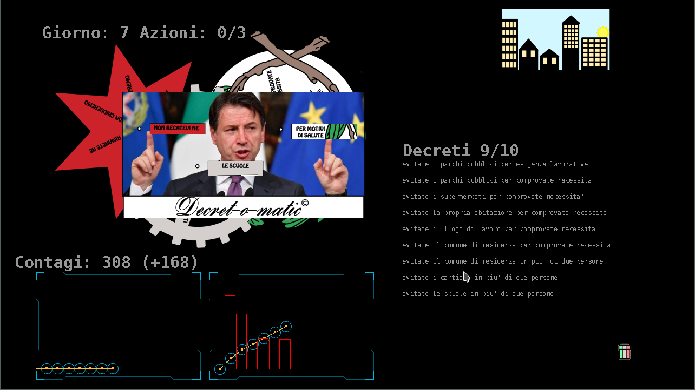

[![CC BY NC ND 2.0][cc-by-nc-nd-shield]][cc-by-nc-nd]

This work is licensed under a [Creative Commons Attribution-NonCommercial-NoDerivs 2.0 Generic License][cc-by-nc-nd].

[![CC BY NC ND 2.0][cc-by-nc-nd-image]][cc-by-nc-nd]

[cc-by-nc-nd]: http://creativecommons.org/licenses/by-nc-nd/2.0/
[cc-by-nc-nd-image]: https://i.creativecommons.org/l/by-nc-nd/2.0/88x31.png
[cc-by-nc-nd-shield]: https://i.creativecommons.org/l/by-nc-nd/2.0/80x15.png

---

**Decret-o-matic** is a game where you must defend your country from a very contagious virus.
Currently the game is only available in Italian but we have plans to have an english version as well. 

This project is currently being ported to a web application with Javascript [here](https://github.com/brleinad/decret-o-matic-web).



# Installing

Download the executable for you OS:
Scarica l'eseguibile per il tuo sistema:
* [Windows](https://github.com/brleinad/decret-o-matic/blob/master/bin/windows/decret-o-matic.exe)
* [Manjaro](https://github.com/brleinad/decret-o-matic/blob/master/bin/manjaro/decret-o-matic)

# Tutorial

## Italiano
Un contagiosissimo virus ha infettato il tuo paese.
Per fortuna puoi aiutare Peppe a sconfiggerlo con raziocinio e scienza.
O almeno cercare di tenerlo a bada a tentativi.

Clicca sulle caselline per mettere in moto gli ingranaggi della politica.
Emetti il decreto cliccando su Decret-o-matic, assumendotene la piena responsabilità.
Il risultato sarà quello sperato? Lo potrai scoprire solo osservando i contagi del giorno successivo.
Se l'effetto sortito non fosse quello sperato puoi sempre revocare i decreti emessi cliccando su ciò che vuoi cancellare e successivamente sul bidoncino.
Ogni giorno puoi compiere tre azioni: emettere un decreto ti costerà un'azione, revocarlo due azioni.
Non sei obbligato ad esaurire le tue azioni: cliccando su "Giorno" arriverà il domani.

Riuscirai a resistere 14 giorni senza superare i 500mila contagi?


## English
A very contagious virus has struck your country.
Fortunately you can help Peppe beat it with reasoning and science. 
Or at least you can try your luck.

Click on the boxes to get the gears of politics running.
Make a decree by clicking on Decret-o-matic, taking full responsibility for the effects.
Will you get the expected result? You will find out the next day.
If the result was not as expected you can always delete decrees by selecting them and then clicking on the bin.
Every day you can do three actions: creating a decree costs one action, deleting a decree costs two actions.
You do not have to use up your three actions: by clicking on "Day" you will skip to the next day.

Will you be able to keep the number of cases below 500k before the 14 days are over?


# How to set up the dev environment

Make sure you have Python 3.8.
To try it for now clone and then do:
```
git clone https://github.com/brleinad/decret-o-matic.git
cd decret-o-matic
python3 -m venv venv
. ./venv/bin/activate 
#C:\> <venv>\Scripts\activate.bat on Windows
pip install -r requirements.txt
python decret-o-matic.py
```

## Generating the executable
To generate the executable file first install pyinstaller:
```
pip install pyinstaller
```
Then run pyinstaller using the .spec file.
```
pyinstaller --clean decret-o-matic.spec
```
and this will create the executable under dist/.


---

# Credits
## Decret-o-matic
Da un'idea di Ubbi e una codifica di DanielRB.
Anche se poi Daniel riportato in carreggiata l'idea di Ubbi e Ubbi ha pasticciato con il codice di Daniel.
Ogni riferimento a epidemie e politici reali è puramente casuale.

Se ti piace diffondi in maniera virale.
Ma tutti i diritti rimangono riservati.

Copyright 2020 Ubbi + DanielRB

ubbagumma@gmail.com daniel.rodas.bautista@gmail.com
